# _Local Business API_

#### By _**Patty Otero**_

#### A practice web api with full CRUD functionality, response pagination and wrapper, versioning, and Swagger UI for a local business directory.

## Technologies Used

* _C#_
* _.NET 5.0_
* _ASP.NET Core_ 
* _Swagger_
* _Entity Framework Core_
* _MySQL Workbench_

## Description
This project was created for Epicodus bootcamp to show proficiency in web APIs.

This API is designed to allow for users to view, query, find a single entry, update a single entry, or delete entries for a database of local businesses. There are two versions, to demonstrate versioning. V1 does not allow for the user to filter responses when using the Get route, while V2 does. Responses will include pagination and a wrapper displaying page routes and important information. You can explore this api with Swagger.

## Setup/Installation Requirements

1. Clone this repository
2. Open your terminal and navigate to the top of this directory
3. Create a file called appsettings.json within the main project folder
4. add the following text to the file inserting your own DATABASE NAME, USER ID, and PASSWORD: 
```
{
  "Logging": {
    "LogLevel": {
      "Default": "Information",
      "Microsoft": "Warning",
      "Microsoft.Hosting.Lifetime": "Information"
    }
  },
  "AllowedHosts": "*",
  "ConnectionStrings": {
      "DefaultConnection": "Server=localhost;Port=3306;database=[DATABASE NAME HERE];uid=[USER ID HERE];pwd=[PASSWORD HERE];"
  }
}
```
5. Navigate to ~/Business in your terminal.
6. Run the following commands:
```dotnet ef database update```
```dotnet build```
```dotnet watch run```

7. Once successfully running, you can access the api through your browser, Swagger, or API platforms like Postman.

## SWAGGER

while the local host is successfully running you can access full CRUD functionality with the API by navigating in your browser to:

`https://localhost:5003/swagger/index.html`

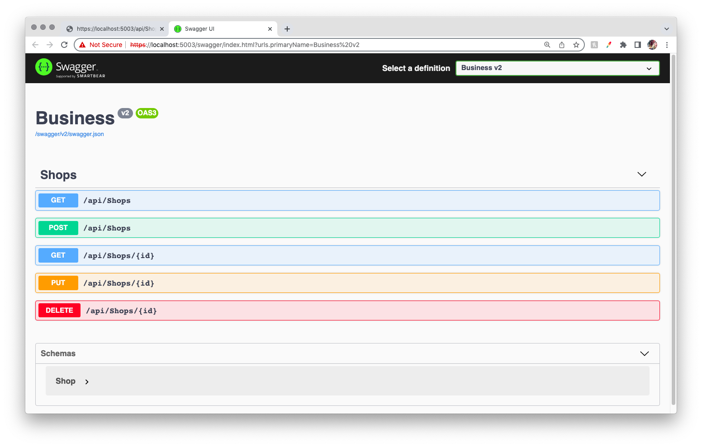

Business V2 is the default version, so whenever you do not specify a version V2 will be used. You can see on Swagger Business v2 is selected in the top right "Select a defintiion" dropdown. By clicking this dropdown you will be able to switch between Version 2 (V2) and Version 1 (V1).

### GET: /api/Shops

If you select v1 and click on the bar that says GET /api/shops, you will see the parameters that v1 accepts. The only difference between v1 and v2 is that v1's GET shops method does not accept query parameters (other than paging and versioning). Below you can see Swagger's ui displaying v1's api/Shops route options:

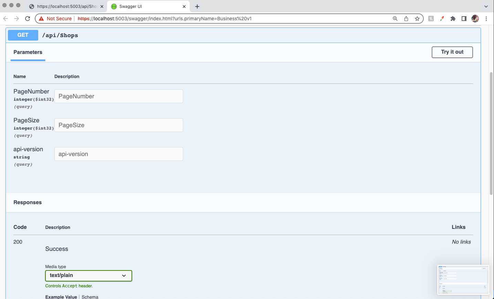

If you click "Try it out" you will be able to type in the Parameters table under the Description header. You may query the results by page number, page size (set to default and to max out at 5 to demonstrate pagination with a small number of database items), and api version (you can enter 1 or 2, if you do not specify a version it will default to v2).

### GET with query filter: /api/Shops?{schema key}={schema value}

If you switch to v2 and select the GET /api/shops you will see that you have more options for parameters than in v1. Clicking on "Try it out", you will be able to edit the descriptions column.

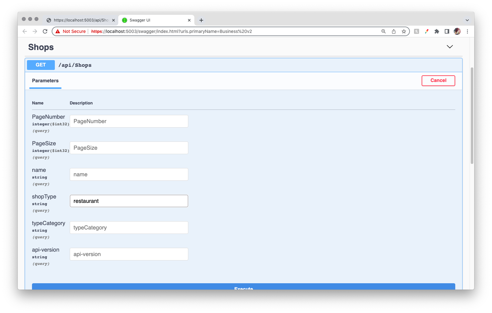

If you type "restaurant" into shopType and click "execute" it will return all shop objects with ShopType "restaurant":

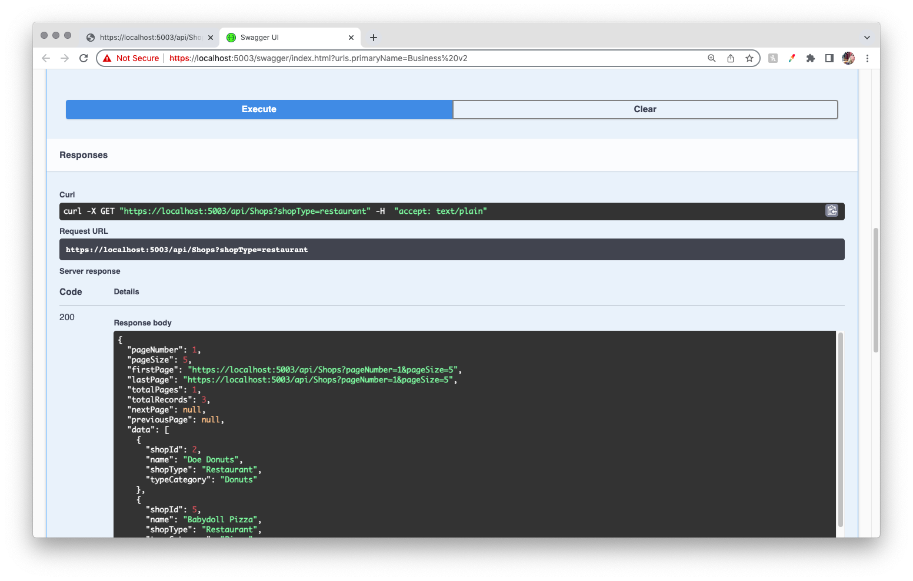

This response is wrapped with information about paging, including urls for first, last, next, and previous page. Then you can see all shop objects that meet your query specifications.

### GET by id: /api/Shops/{id}

In Swagger select the bar that says GET /api/Shops/{id}. 

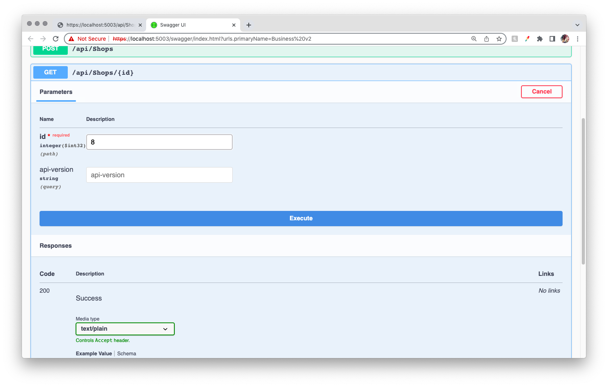

You are required to enter an id number. Once entering an id number and selecting execute, the response will show the object with that id number.

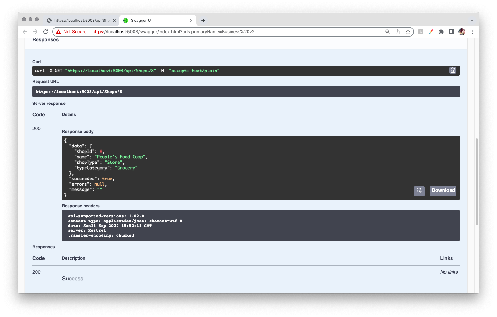

### PUT: /api/Shops/{id}

In Swagger select the bar that says PUT: /api/Shops/{id}. Select "Try it out" and enter the id of the object entry you would like to edit. You must fill in ALL information, even for parameters that will not be changed. You will be able to click on the Request Body field and edit the schema to match the edits you would like to make. 

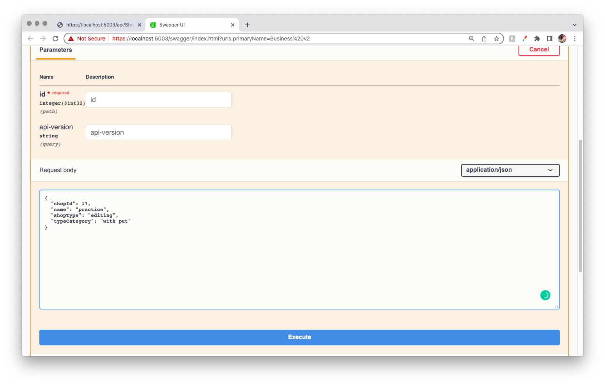

Once complete click "execute" to see your updated object.

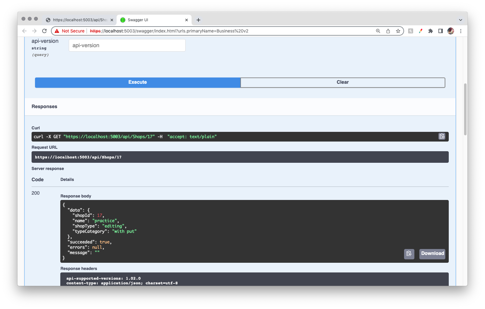

### DELETE by  id: /api/Shops/{id}

In Swagger select the bar that says DELETE: /api/Shops/{id}. 

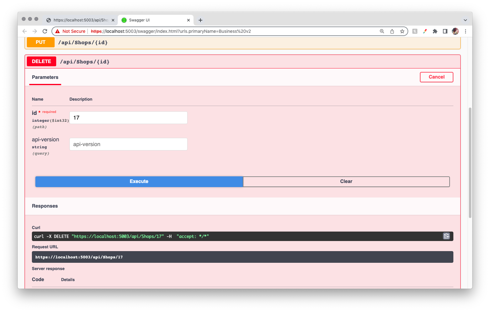

By submitting the id you would like removed and executing, that entry will be removed from the api database.

## BROWSER

Once your local host is successfully runing you can access the api endpoints simply in your browser. Using an extension like this one for Chrome:
`<link>` : <https://chrome.google.com/webstore/detail/json-formatter/bcjindcccaagfpapjjmafapmmgkkhgoa?hl=en>
can make your API endpoints more readable.

### GET:
#### v1: `https://localhost:5003/api/Shops?api-version=1`
The only difference between v1 and v2 is that v1 cannot accept query parameters regarding the Shop model. It can accept parameters regarding versions and paging. The default version is v2, so unless explicitly including `api-version=1` in your url, it will navigate to v2.

Navigate to the following url in your browser to access v1: `https://localhost:5003/api/Shops?api-version=1` 

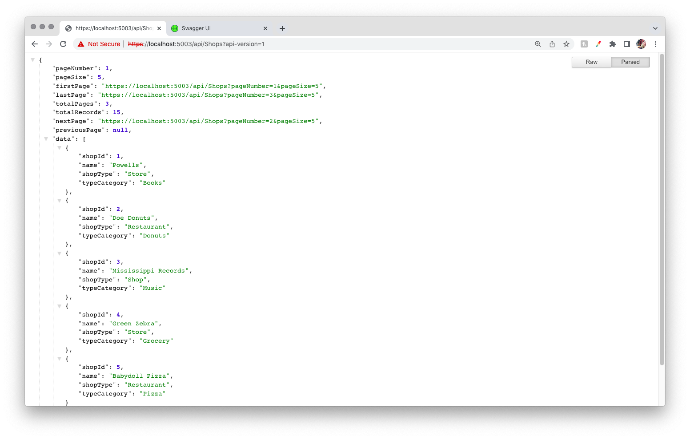

#### v2: `https://localhost:5003/api/Shops`
And here you can see the url and the response for v2, or without including a version query. 

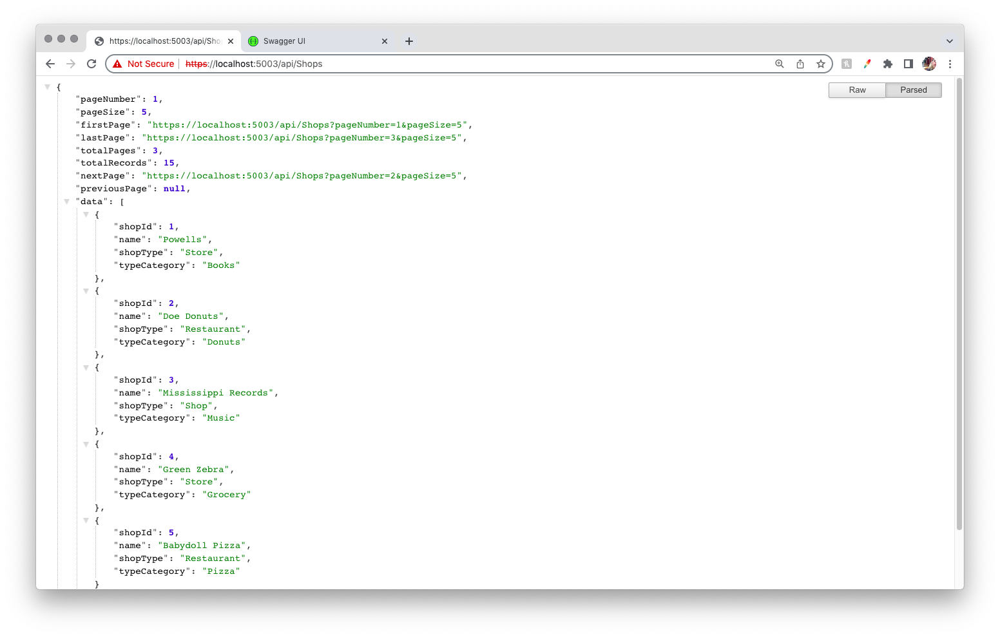

### GET with query filter: /api/Shops?{schema key}={schema value}

for example: 
`https://localhost:5003/api/Shops?shopType=restaurant`

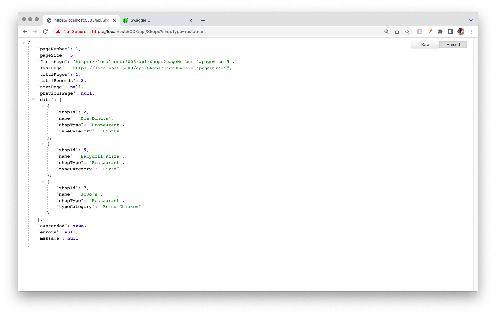

you can add as many individual queries as you would like to the url route.

### GET by id: /api/Shops/{id}
for example: `https://localhost:5003/api/Shops/1`

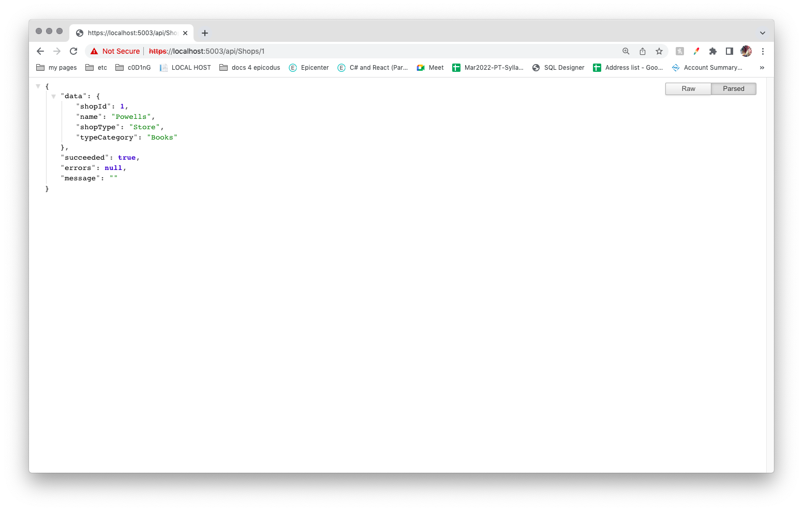

### PUT and DELETE:
PUT and DELETE are not accessible in the browser, you need Swagger, Postman, a client side application, or similar platform that can send bodies and headers.

## Known Bugs

* _ none _

## License

_MIT_

Copyright (c) _2022_ _Patty Otero_