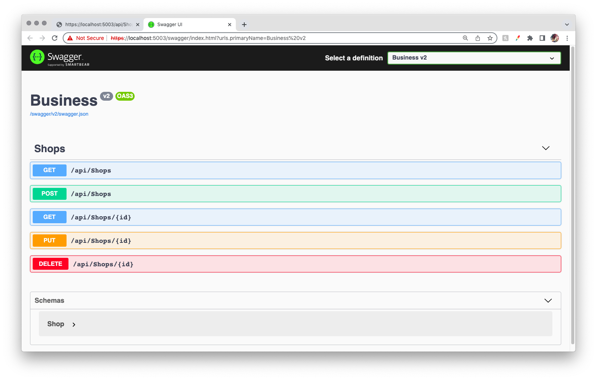
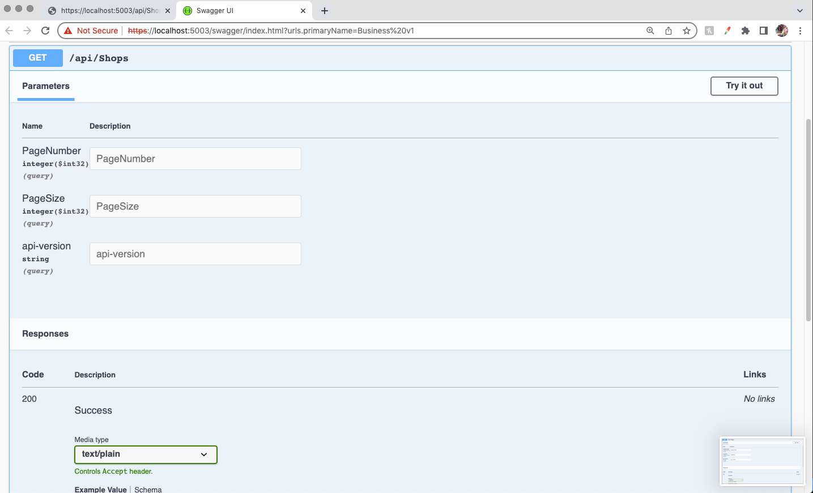

# _Local Business API_

#### By _**Patty Otero**_

#### _A practice web api with full CRUD functionality, response pagination and wrapper, versioning, and Swagger UI for a local business directory._

## Technologies Used

* _C#_
* _.NET 5.0_
* _ASP.NET Core_ 
* _Swagger_
* _Entity Framework Core_
* _MySQL Workbench_

## Description
_This project was created for Epicodus bootcamp to show proficiency in web APIs._

_This API is designed to allow for users to view, query, find a single entry, update a single entry, or delete entries for a database of local businesses. There are two versions, to demonstrate versioning. V1 does not allow for the user to filter responses when using the Get route, while V2 does. Responses will include pagination and a wrapper displaying page routes and important information. You can explore this api with Swagger._

## Setup/Installation Requirements

* Clone this repository
* Open your terminal and navigate to the top of this directory
* create a file called appsettings.json within the main project folder
* add the following text to the file inserting your own DATABASE NAME, USER ID, and PASSWORD: 
````{
  "Logging": {
    "LogLevel": {
      "Default": "Information",
      "Microsoft": "Warning",
      "Microsoft.Hosting.Lifetime": "Information"
    }
  },
  "AllowedHosts": "*",
  "ConnectionStrings": {
      "DefaultConnection": "Server=localhost;Port=3306;database=[DATABASE NAME HERE];uid=[USER ID HERE];pwd=[PASSWORD HERE];"
  }
}````
* Navigate to ~/Business in your terminal.
* Run the following commands:
>dotnet ef database update
>dotnet build
>dotnet watch run
* Once successfully running, you can access the api through your browser, Swagger, or API platforms like Postman.

## SWAGGER

while the local host is successfully running you can access full CRUD functionality with the API by navigating in your browser to:

````https://localhost:5003/swagger/index.html````



Business V2 is the default version, so whenever you do not specify V2 will be used. You can see on Swagger Business v2 is selected in the top right "Select a defintiion" dropdown. By clicking this dropdown you will be able to switch between Version 2 (V2) and Version 1 (V1).

The only difference between v1 and v2 is that v1's GET shops method does not accept query parameters. Below you can see Swagger's ui displaying v1's api/Shops route options:



## BROWSER
### GET: /api/Shops
### GET with query filter: /api/Shops?{schema key}={schema value}
#### for example: https://localhost:5003/api/Shops?shopType=restaurant
#### you can add as many individual queries as you would like to the url route.
### GET by id: /api/Shops/{id}
### DELETE by  id: /api/Shops/{id}


## POSTMAN
#### using Postman while the local host is successfully running you can use these routes and the Postman options to access full CRUD functionality with the API.
### GET: /api/Shops
### GET with query filter: /api/Shops?{schema key}={schema value}
### GET by id: /api/Shops/{id}
### DELETE by  id: /api/Shops/{id}

## Known Bugs

* _ none _

## License

_MIT_

Copyright (c) _2022_ _Patty Otero_